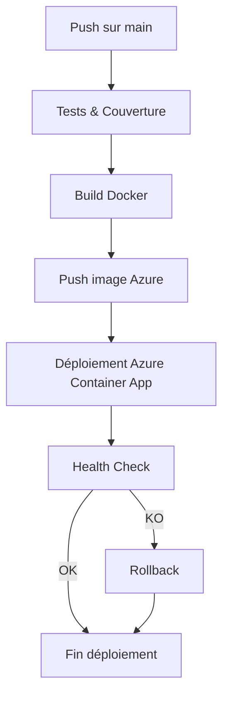

# Schéma visuel du pipeline CI/CD BookSync API Agent

Ce document présente le pipeline CI/CD sous forme de diagramme et détaille la traçabilité (logs, artefacts, audit) pour garantir la conformité E3.

---

## 1. Diagramme du pipeline CI/CD

- **A** : Commit/push sur la branche principale
- **B** : Exécution des tests unitaires, d'intégration et rapport de couverture
- **C** : Construction de l'image Docker
- **D** : Push de l'image sur Azure Container Registry
- **E** : Déploiement sur Azure Container App
- **F** : Vérification du health check
- **H** : Rollback automatique si le health check échoue

---

## 2. Traçabilité du pipeline

### A. Gestion des logs
- Les logs de chaque étape (tests, build, déploiement, health check) sont conservés dans GitHub Actions (onglet "Actions")
- Les logs de l'application sont accessibles via Azure Container App et peuvent être exportés pour audit

### B. Artefacts
- Les rapports de couverture (HTML, XML) sont générés et stockés comme artefacts dans GitHub Actions
- Les images Docker sont versionnées dans Azure Container Registry

### C. Audit des étapes CI/CD
- Chaque exécution du pipeline est historisée dans GitHub Actions (date, auteur, commit, statut)
- Les déploiements et rollbacks sont tracés dans Azure (logs, historique des images)
- Les alertes et incidents sont archivés pour analyse et amélioration continue

---

**Résumé :**
Ce document permet de visualiser le pipeline CI/CD et d'assurer la traçabilité complète pour la certification E3.

